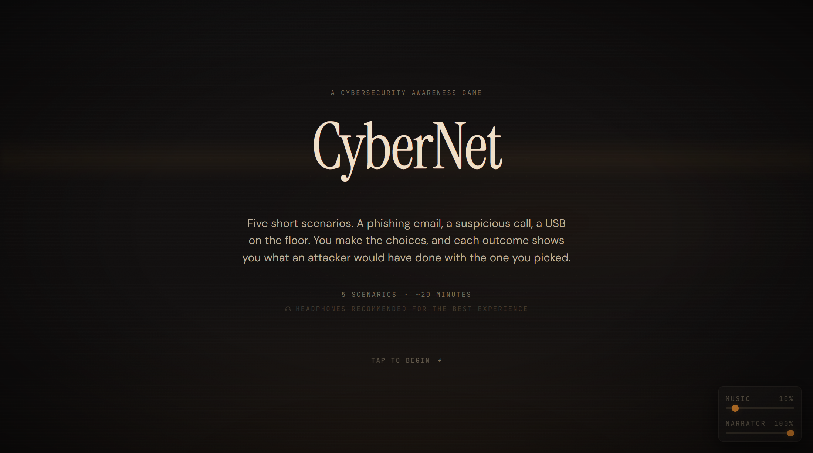
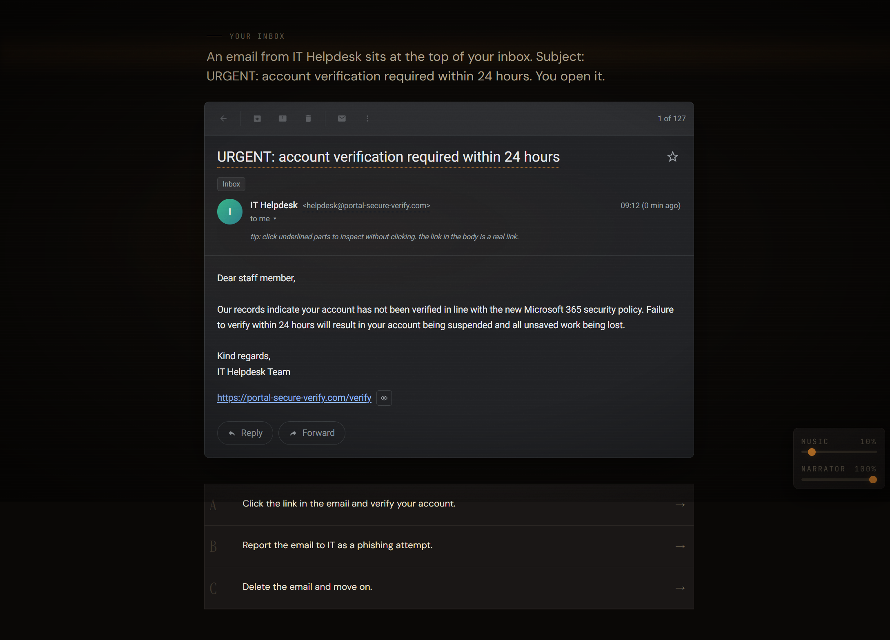
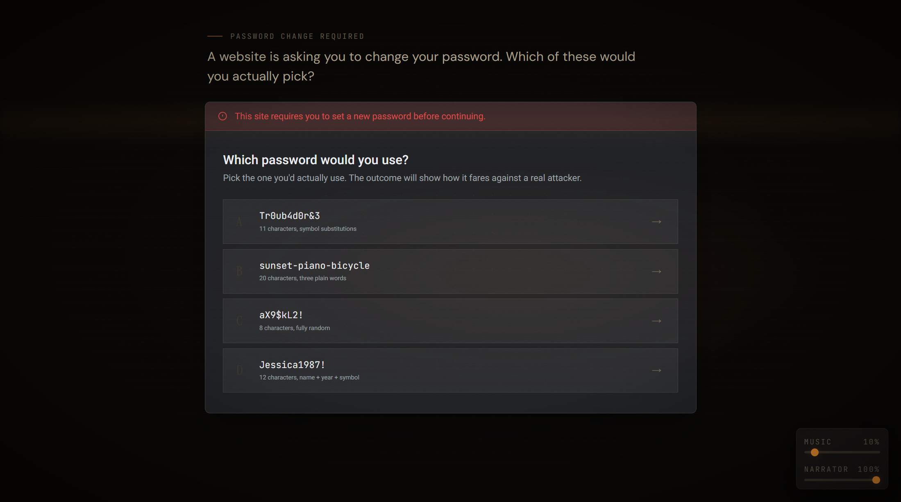
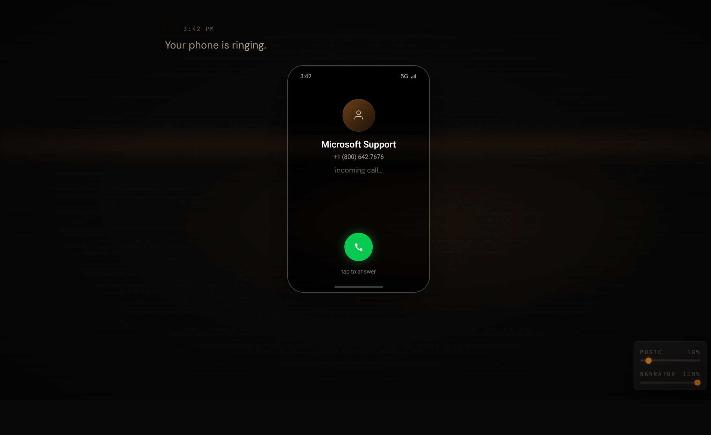
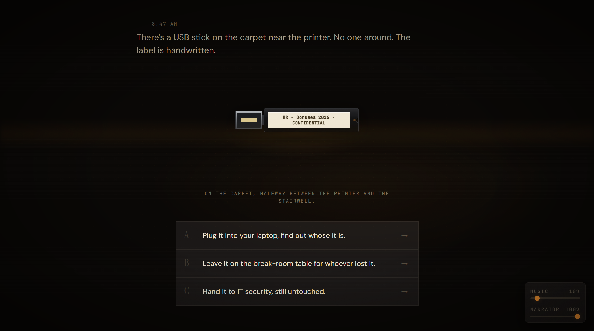
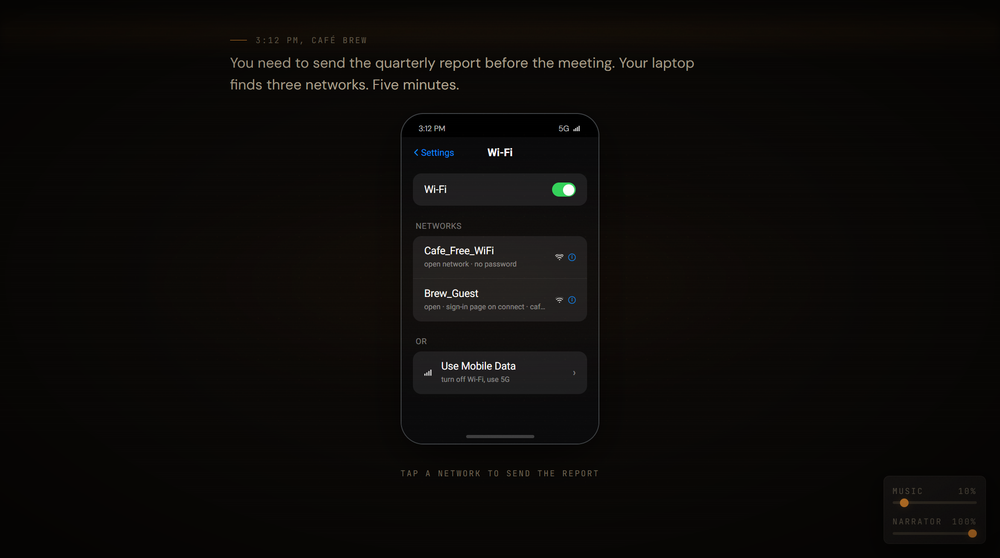

# CyberNet

> A scenario-based web serious game for everyday cybersecurity awareness.

**Live demo:** <https://cybernet-awareness.vercel.app>



The player works through five short attack scenarios: a phishing email, a password pick, a voice-phishing call, a dropped USB, and a public Wi-Fi choice. Each one is a branched decision. After the choice, an outcome screen shows what an attacker would have done with it, and a narrated debrief names the lesson.

The same build works as both a public demo and as the instrument for a user study. The study flow is: consent → pre-test → five scenarios → post-test → engagement survey → optional demographics → done.

---

## Introduction

Cybersecurity is a human problem as much as a technical one. Firewalls and intrusion-detection systems guard the perimeter, but most successful attacks still come through everyday mistakes: a phishing link clicked, a reused password, an unknown USB plugged in (Hadlington 2017; Dinet 2016). Traditional awareness training (annual e-learning modules, compliance courses) struggles to hold attention and rarely shifts behaviour (Moumouh et al. 2025; Ng & Hasan 2025).

CyberNet asks a narrower question: can a short, scenario-based web game help non-experts recognise five common attack vectors (phishing, weak passwords, vishing, dropped USBs, public Wi-Fi) well enough to move the needle on a short pre/post knowledge test?

The prototype is a web app. One link serves both a casual playthrough and a full study session. Data collection is ongoing; empirical results will land in a later version of the thesis.

## Related work

**Human factors.** Most security incidents have a human component. Impulsivity, attitudes toward security, and everyday digital habits correlate with risky behaviour online (Hadlington 2017). Risk perception varies with social and cultural context (Dinet 2016). Traditional awareness programmes struggle to convert intention into action. Systematic reviews find many small-scale interventions with inconsistent behavioural transfer (Ng & Hasan 2025; Moumouh et al. 2025; Gwenhure & Rahayu 2024).

**Serious games for cybersecurity.** Scenario-based serious games tend to show short-term gains in knowledge and self-efficacy, especially on phishing and social-engineering topics (Kassner & Schönbohm 2022; Henderson et al. 2024; Le-Nye et al. 2024). Gamified training reduces phishing click-through compared with baseline courses (Bitrián et al. 2024). Designs grounded in the Theory of Planned Behaviour report improvements in attitudes and intention (Steen & Deeleman 2021; Salameh & Loh 2022). Other modalities include card games (Denning et al. 2013), simulators like CyberCIEGE (Irvine et al. 2005), escape rooms (Spatafora et al. 2024), and culturally-anchored designs (Wa Nkongolo 2024).

**Pedagogical frameworks.** The design draws on three lenses:

- **MDA** — Mechanics, Dynamics, Aesthetics. A shared vocabulary that links game mechanics, the player's experience, and learning outcomes (Kusuma et al. 2018).
- **MOTENS** — a cybersecurity-specific pedagogical model that ties threat scenarios to formative feedback and observable outcomes (Hart et al. 2021).
- **Garris input-process-outcome loop** — repeated play-and-debrief is how engagement turns into learning (Garris et al. 2002).

Engagement is assessed through items adapted from the Technology Acceptance Model (Davis 1989). Broadly, the design follows a constructivist view: durable knowledge comes from experience plus reflection (Dagar & Yadav 2016).

## The five scenarios

1. **Phishing, IT Helpdesk.** An inbox with a plausible IT-helpdesk email. Hover hotspots on the sender, subject, and link reveal what is suspicious. Three actions: click, report, or delete. The link is a trap: an accidental click routes straight to the compromised outcome.

   

2. **Password, Pick your password.** Four candidates, each representing a common heuristic: a leet-substituted dictionary word, a three-word passphrase, a short random string, or a memorable personal pattern. The outcomes cover passphrase strength, short-random inadequacy, and dictionary-plus-substitution or name-plus-year weakness.

   

3. **Vishing, Microsoft Support scam.** A three-phase phone call: a looping ringtone, scripted caller lines in a distinct voice, and typed subtitles that track the audio. Three decisions: comply, hang up and call back, or hang up without callback.

   

4. **USB drop.** A found USB stick with a handwritten label. Three branches: plug it in, leave it in a shared area, or hand it to IT. The outcomes cover BadUSB, payloaded autorun, and credential-harvesting documents.

   

5. **Public Wi-Fi.** A mobile Wi-Fi settings screen with three networks: an open hotspot that is actually an evil twin, a legitimate café network behind a captive portal, and cellular tethering as a don't-connect option. Each outcome explains what traffic leaks where.

   

## Design

### Learning objectives

CyberNet targets recognition of five everyday attack vectors. Each objective is stated at the identify–explain–choose level and is tied to exactly one scenario:

1. **Phishing signal recognition.** Identify the cues that a routine-looking work email is a phishing lure (sender domain mismatch, pressure framing, suspicious link).
2. **Password strength judgement.** Distinguish candidates that *resemble* strength (leet substitutions, name-plus-year) from candidates that actually resist common attacks (long passphrases, short random strings paired with a manager).
3. **Caller-identity verification.** Recognise the typical vishing script (a "support team" manufacturing urgency to extract credentials) and the appropriate response: independent callback through a verified number.
4. **Physical-media baiting.** Recognise that a found storage device is a plausible social-engineering vector (BadUSB, keystroke injection, payloaded autorun), and that the safe response is to hand the device to IT rather than inspect it personally.
5. **Public Wi-Fi trust model.** Recognise that open hotspots and captive-portal networks carry distinct exposure profiles, and that cellular tethering is the safest default in public settings.

Each objective maps onto two items of the ten-question knowledge instrument and onto the narrated debrief of the corresponding scenario.

### Six design principles

1. **Feedback at every decision.** Every choice produces a typed outcome beat, then a concept-level debrief. No silent branching.
2. **Progressive difficulty.** Early scenarios reward surface-signal recognition (phishing, passwords). Later scenarios require structural reasoning about trust and network sharing (public Wi-Fi).
3. **Narrative immersion.** Each scenario is a plausible everyday moment — an email at the top of the inbox, a phone ringing, a USB on the floor — not an abstract drill.
4. **Goal clarity.** Each decision scene strips the interface to the information needed to choose, and nothing more.
5. **Bounded agency.** Three or four options per decision. Not a yes/no (false dichotomy), not a long list (choice paralysis).
6. **Explicit debrief.** Each scenario closes with a short takeaway line and a longer lesson paragraph, consistent with MOTENS and the constructivist view of experience plus reflection.

### Scenario construction

Each scenario is a short directed graph of typed scenes: `stimulus`, `decision`, `outcome`, `debrief`, `quiz`. At the decision point the player has three or four options; each routes to a distinct outcome beat that names the underlying attack mechanic, and each outcome is followed by a narrated debrief.

## Implementation

### Tech stack

- **Next.js 16** (App Router) + **React 19** + **TypeScript**
- **Tailwind CSS 4**
- **Motion** (formerly Framer Motion) for scene transitions
- **Supabase** (Postgres + REST) for anonymous session and event logging
- **ElevenLabs** for pre-generated narration, shipped as static mp3 assets
- Deployed on **Vercel**

### Scenario engine

Scenarios live as typed data in `src/lib/scenarios/`. At runtime a scene runner walks the graph, hands the current scene to the right rendering surface (email card, phone frame, Wi-Fi settings view, found-USB view, account-settings form), and advances on the player's input. The surfaces are plugged in through a small registry; the scene graph is the single source of truth for decision content.

### Audio pipeline

Narration is pre-generated. A dev-time script walks the scenario data, splits each narrated passage into sentence-level beats, and calls ElevenLabs once per beat. The resulting mp3s are committed as static assets, so scenario playback has no runtime API calls and no network dependency.

Two voices are used: a cinematic narrator for intro and debrief beats, and a distinct caller voice used only for the vishing character. Narrator and background-music channels have independent volume controls that take effect mid-playback.

### Accessibility

Accessibility is part of the initial design, not a retrofit. Option buttons, confidence ratings, and Likert responses are marked up as radio groups so screen readers expose the selection state. The focus outline is visible on both light and dark button fills. Animations respect `prefers-reduced-motion`. The entire participant route is operable by keyboard alone, and the click-to-advance narrative surface exposes a keyboard equivalent.

## Study methodology

### Research questions

- **RQ1 (Design).** Can a scenario-based web game encode five everyday cybersecurity threats as playable decisions whose branched outcomes teach the targeted learning objectives?
- **RQ2 (Learning).** Does exposure to the prototype measurably improve knowledge of the targeted concepts between pre- and post-test, and does any improvement appear across all five concept areas or only on some?
- **RQ3 (Engagement and transfer).** Do participants report the intervention as useful, easy to use, and likely to change their online behaviour? Does self-rated awareness correlate with measured knowledge, and do the presentation layers (narration, music, visual design) contribute to reported engagement?

### Research design

A single-group, within-subjects, pre- and post-test quasi-experimental study: each participant is their own control. This is the standard pattern for scenario-based awareness studies (Steen & Deeleman 2021; Bitrián et al. 2024; Le-Nye et al. 2024). It fits when the research question concerns within-participant change, not relative efficacy against a rival intervention. The unit of analysis is the individual participant; the unit of observation is the scene-level decision together with item-level pre/post responses.

### Participants

Target population: adults with everyday digital exposure and no required cybersecurity background. Recruitment is convenience sampling via student communities, online forums, and the author's personal network. No compensation offered. Target is at least fifty completed sessions, informed by sample sizes reported in comparable scenario-based awareness studies (Le-Nye et al. 2024). Inclusion criteria: age eighteen or older, adequate English reading, browser access.

### Instruments

Five instruments are used.

1. **Informed consent.** Anonymity, two-year retention horizon, and a contact address. Because sessions carry only a random identifier, they cannot be retrieved or deleted after submission.
2. **Pre-test (ten items).** Two items per concept area, four options each. Each option is written as something a participant might plausibly do or believe, so the correct answer is not recognisable from the wording. Most items are first-person ("what do you do?"); a minority are evaluative, where reasoning about the attack is required. Correct-answer positions are balanced across the four slots. Each item collects an optional binary confidence marker.
3. **Post-test (ten items).** The same items, reversed order. Parallel-form isomorphic items were considered and rejected because they would dilute the paired comparison.
4. **Engagement survey (eleven Likert items).** Eight TAM-style items (ease of use, engagement, realism, perceived learning, self-efficacy, behavioural intention, willingness to recommend) (Davis 1989; Steen & Deeleman 2021) plus three items on the presentation layer: narration helpfulness, music contribution, visual engagement.
5. **Demographics (twelve items).** Age range, gender, current role, field of study or work, primary language used day-to-day, prior cybersecurity training, password-manager use, two-factor-authentication use, prior phishing or scam victimisation, frequency of public Wi-Fi use, a risk-tolerance self-rating, and an overall self-rated cybersecurity awareness rating. Collected after the intervention to avoid priming pre-test responses.

A scene-level event log records every decision and outcome reached; the log feeds procedural checks and per-scenario choice analysis.

### Procedure

A single session of about twenty minutes. Fixed route: informed consent → short briefing (four-step arc) → ten-item pre-test → boot intro → five scenarios → ten-item post-test → eleven-item engagement survey → optional demographics → thank-you.

### Data analysis plan

Primary analysis: paired-samples *t*-test on overall pre/post accuracy across completed sessions. Wilcoxon signed-rank is substituted where the normality assumption fails. Effect sizes reported as Cohen's *d*. A per-concept analysis runs the same paired test within each of the five concept areas, reporting the pattern of gains alongside the aggregate result.

Covariate analysis stratifies on prior-training level and self-rated awareness to test whether gains differ between novices and participants with formal background. Engagement items are reported descriptively; the composite engagement score is correlated with the pre/post delta. The three presentation items (narration, music, visuals) are reported separately and cross-tabulated with the overall engagement score. Calibration is assessed through the rate of confident-wrong responses before vs. after the intervention, as a probe of whether the game reduces confident errors.

### Threats to validity

- **Construct validity** is bounded by the size of the knowledge instrument: ten items are a small sample of the cybersecurity awareness space, and results generalise only to the five concept areas represented.
- **Internal validity** is limited by the absence of a control group. A pre/post gain in a single-group design cannot be cleanly separated from a test-retest or novelty effect. The per-concept pattern and the engagement correlations provide context for interpretation.
- **External validity** is bounded by convenience sampling, which likely skews toward tech-adjacent participants. The demographic form captures this for interpretation.
- **Durability** cannot be tested in a single-session design, so claims about retention are deferred.

### Ethical considerations

No deception, no exposure to real credentials, no collection of sensitive personal data. The informed-consent page states the retention horizon and the anonymity trade-off explicitly: because sessions carry only a random identifier, they cannot be retrieved or deleted after submission. Data are pseudonymised by design: no names, no email addresses, no IP addresses are captured application-side. All records are stored in a European region.

## Running locally

```bash
npm install
cp .env.local.example .env.local   # fill in Supabase + ElevenLabs keys
npm run dev
```

Open <http://localhost:3000>.

### Environment variables

| Variable | Required | Purpose |
|---|---|---|
| `NEXT_PUBLIC_SUPABASE_URL` | yes | Supabase project URL |
| `NEXT_PUBLIC_SUPABASE_ANON_KEY` | yes | Supabase anon JWT |
| `SUPABASE_SERVICE_ROLE_KEY` | optional | Server-side event insertion |
| `ELEVENLABS_API_KEY` | dev only | Used by the audio-generation script |
| `ELEVENLABS_NARRATOR_VOICE_ID` | dev only | Cinematic narrator voice |
| `ELEVENLABS_DAVID_VOICE_ID` | dev only | Scam caller voice |

### Database

Run `supabase/migrations/0001_initial.sql` in the Supabase SQL Editor to create the `sessions` and `events` tables. Row-Level Security is configured for anonymous insert-only access, with a separate read-only role for analysis.

### Regenerating audio

Narration is committed as static assets. Regenerate with:

```bash
npm run gen:audio -- --dry     # preview what would be generated
npm run gen:audio              # generate missing mp3s
npm run gen:audio -- --force   # regenerate everything
```

## Study-flow reference

| Step | Route | Instrument |
|---|---|---|
| 1 | `/` | Landing |
| 2 | `/consent` | Informed consent, creates anonymous session |
| 3 | `/briefing` | Four-step arc explained |
| 4 | `/pretest` | 10-item multiple-choice knowledge test |
| 5 | `/play` → `/scenario/[id]` | Boot intro + five scenarios |
| 6 | `/posttest` | Same 10 items, reversed order |
| 7 | `/survey` | 11-item Likert engagement survey |
| 8 | `/demographics` | Optional 12-item demographic form |
| 9 | `/done` | Thank-you |

## Status and future work

The user study is still running. Results (knowledge deltas, engagement breakdowns, demographic splits) will go in the next version of the thesis.

Three follow-ups extend this work:

1. **Broader knowledge instrument with untaught controls.** The ten-item test is small by design. A companion study with a wider item bank and untaught-control items would cleanly separate taught gains from test-retest effects and let internal-validity claims be made more sharply.
2. **Longitudinal retention add-on.** A follow-up measurement at two to four weeks after the session would address the durability gap that a single-session design leaves open.
3. **LLM agent-persona replay.** Each human participant's recorded demographics would be turned into a persona prompt; an automated agent then plays the same five scenarios under that persona, and its choices are compared against the matched human's actual choices. The result is a matched-pairs comparison rather than an abstract persona sweep. Deferred to a future cycle.

## Project layout

```
src/
  app/                 Next.js routes (one per study step)
  lib/                 Scenario data, instruments, session state
  components/          UI (scenarios, mocks, audio controls)
scripts/
  generate-audio.ts    Dev-time ElevenLabs pipeline
supabase/
  migrations/          Postgres schema + RLS policies
public/
  audio/               Pre-generated narration mp3s
  art/                 SVG art assets
screenshots/           README imagery
```

## Academic context

CyberNet is the prototype for a bachelor's thesis at Innopolis University (2026):

> Jaafar, M. (2026). *Motivation and Design of a Serious Game for Cybersecurity.* Bachelor's thesis, Innopolis University. Supervisor: Prof. Paolo Ciancarini.

## References

- Bitrián, P., Buil, I., Catalán, S., & Merli, D. (2024). Gamification in workforce training. *Journal of Business Research* 179, 114685.
- Dagar, V., & Yadav, A. (2016). Constructivism: a paradigm for teaching and learning. *Arts and Social Sciences Journal* 7.
- Davis, F. D. (1989). Perceived usefulness, perceived ease of use, and user acceptance of information technology. *MIS Quarterly* 13(3), 319–340.
- Denning, T., Lerner, A., Shostack, A., & Kohno, T. (2013). Control-Alt-Hack: the design and evaluation of a card game for computer security awareness and education. *Proceedings of ACM CCS*, 915–928.
- Dinet, J. (2016). Human factors and information security: impact of individual, social and culture environment. (Working paper.)
- Garris, R., Ahlers, R., & Driskell, J. E. (2002). Games, motivation, and learning: a research and practice model. *Simulation & Gaming* 33(4), 441–467.
- Gwenhure, A., & Rahayu, F. (2024). Gamification of cybersecurity awareness for non-IT professionals: a systematic literature review. *International Journal of Serious Games* 11, 83–99.
- Hadlington, L. (2017). Human factors in cybersecurity; examining the link between internet addiction, impulsivity, attitudes towards cybersecurity, and risky cybersecurity behaviours. *Heliyon* 3.
- Hart, S., Halak, B., & Sassone, V. (2021). MOTENS: a pedagogical design model for serious cyber games.
- Henderson, N., Pallett, H., van der Linden, S., Montanarini, J., & Buckley, O. (2024). The disPHISHinformation game: creating a serious game to fight phishing using blended design approaches.
- Irvine, C., Thompson, M. F., & Allen, K. (2005). CyberCIEGE: gaming for information assurance. *IEEE Security & Privacy* 3(3), 61–64.
- Kassner, L., & Schönbohm, A. (2022). A serious game to improve phishing awareness. *Proceedings of ICISSP*, 109–117.
- Kusuma, G. P., Wigati, E. K., Utomo, Y., & Suryapranata, L. K. P. (2018). Analysis of gamification models in education using MDA framework. *Procedia Computer Science* 135, 385–392.
- Le-Nye, E., Yaacoub, C., & Possik, J. (2024). Evaluating phishing awareness strategies. *Procedia Computer Science* 251, 666–671.
- Moumouh, C., García Berná, J., Chkouri, M. Y., & Fernández-Alemán, J. (2025). Serious games to improve privacy and security knowledge for professionals: a systematic literature review. *International Journal of Serious Games* 12, 3–24.
- Ng, C. Y., & Hasan, M. K. B. (2025). Cybersecurity serious games development: a systematic review. *Computers & Security* 150, 104307.
- Salameh, R., & Loh, C. (2022). Engagement and players' intended behaviors in a cybersecurity serious game. *International Journal of Gaming and Computer-Mediated Simulations* 14(1), 1–21.
- Spatafora, A., Wagemann, M., Sandoval, C., Leisenberg, M., & Carvalho, C. (2024). An educational escape room game to develop cybersecurity skills. *Computers* 13(8), 205.
- Steen, T., & Deeleman, J. (2021). Successful gamification of cybersecurity training. *Cyberpsychology, Behavior, and Social Networking* 24.
- Wa Nkongolo, M. (2024). Infusing Morabaraba game design to develop a cybersecurity awareness game (CyberMoraba). *ICCWS* 19, 240–250.

## Licence

MIT. See [`LICENSE`](LICENSE).

## Acknowledgements

Supervised by Prof. Paolo Ciancarini at Innopolis University. Narration generated with ElevenLabs. Data infrastructure by Supabase.
